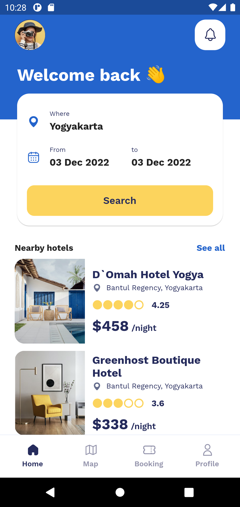
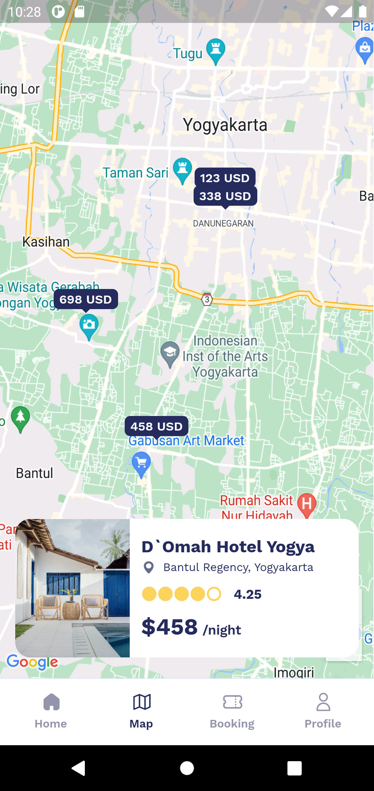
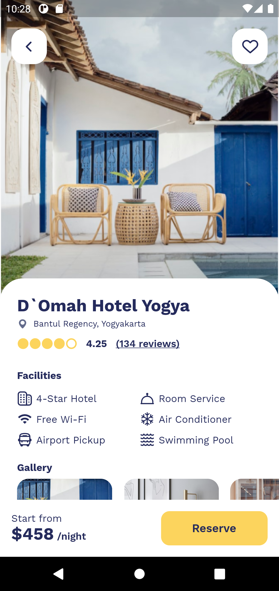

# flutter_hotel_app_ui

A Flutter hotel booking app. UI by [maxonflutter](https://maxonflutter.com/)

### Dependencies

add .env file

```.env
// .env
GOOGLE_MAPS_API_KEY=YOUR_API_KEY
```

## App Preview




